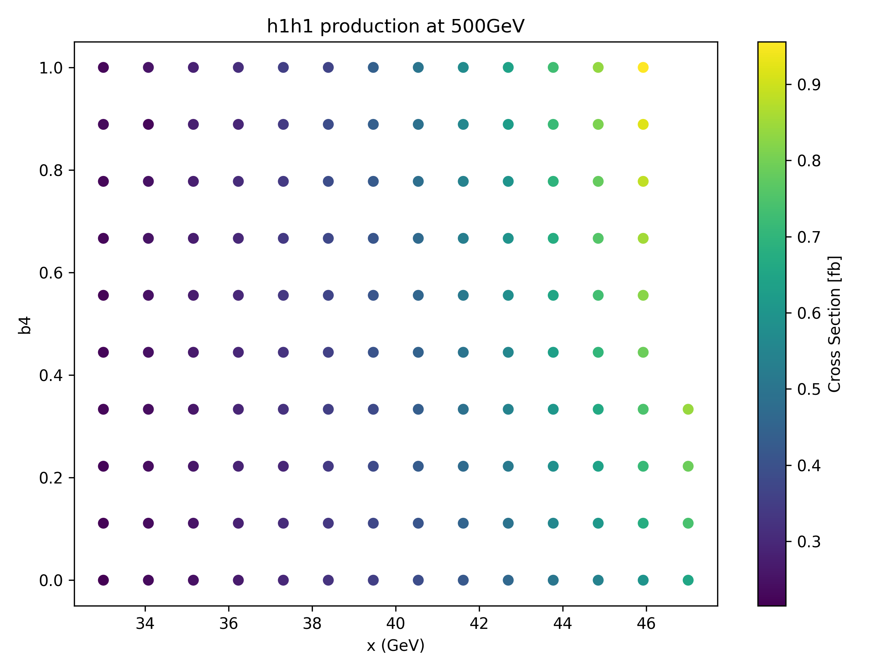
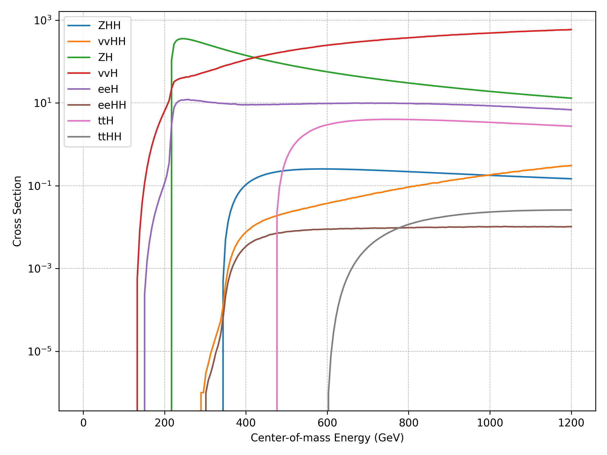

# Higgs Production in SM and Extended Scalar Models

This repository contains a computational analysis of scalar production processes in the Standard Model (SM) and in an extended scalar sector model.

The study is based on event generation performed with MadGraph and numerical post-processing developed in Python.

---

## Project Structure

higgs-production-sm-bsm-analysis/

│  
├── model/               # Theoretical description of the model  
├── scripts/             # Python analysis scripts  
├── data/  
│   ├── raw/             # MadGraph output files  
│   │   ├── sm/  
│   │   └── bsm/  
│   │       ├── 500GeV/  
│   │       ├── 1000GeV/  
│   │       └── 1500GeV/  
│   └── processed/       # Processed numerical summaries  
│  
└── results/  
    ├── plots/           # Generated figures  
    └── tables/          # Numerical comparison tables  

---

## Physics Scope

Energy-dependent production analysis of scalar bosons.

### Standard Model (SM)
- Multi-channel Higgs production energy scan.

### Extended Scalar Sector (BSM)
Study of scalar pair production in electron-positron collisions:
- e⁺ e⁻ → h1 h1  
- e⁺ e⁻ → h1 h2  
- e⁺ e⁻ → h2 h2  

Evaluated at:
- 500 GeV  
- 1000 GeV  
- 1500 GeV  

---
## Scientific Objectives

This project investigates the production of scalar Higgs pairs in an extended Higgs sector model at electron-positron colliders.

The primary goals are:

- To compute production cross sections for:
  - h1h1
  - h1h2
  - h2h2
- To analyze their dependence on center-of-mass energy (500, 1000, 1500 GeV)
- To estimate expected event yields assuming fixed integrated luminosity
- To compare relative production strengths between scalar channels

The focus is not on SM vs BSM comparison, but on internal hierarchy and energy scaling within the extended scalar sector.

---

##  Methodology

- Matrix element generation: MadGraph5_aMC@NLO
- Cross section extraction from event files
- Statistical processing with NumPy
- Log-scale visualization for hierarchical comparison
- Energy scaling analysis across fixed √s values

NaN values arising from kinematic restrictions are handled using nan-aware statistical estimators.

---

##  Results Overview

### BSM Results


The h1h1 channel dominates at lower energies, while heavier scalar production becomes competitive at √s = 1500 GeV.


### SM Validation


The Standard Model calculation was used as a validation benchmark against known results.


---
## Tools Used

- MadGraph5_aMC@NLO  
- Python 3  
- NumPy  
- Matplotlib  

---
##  Reproducibility

All numerical results and plots in this repository can be reproduced by running:

```bash
python scripts/bsm_cross_sections.py
python scripts/process_energy_analysis.py
```
The analysis assumes raw cross section outputs generated with MadGraph5_aMC@NLO.

---

##  Potential Extensions

- Differential cross section analysis
- Parameter scan over scalar masses
- Comparison with EFT approximations
- Collider luminosity scaling studies
---

## Full Thesis

The complete undergraduate thesis is available here:

[Download PDF](docs/TFG_Esther_Menendez_Ibanez.pdf)

---
## Author

Esther Menéndez Ibáñez  
BSc Physics  
Computational Physics & Simulation
